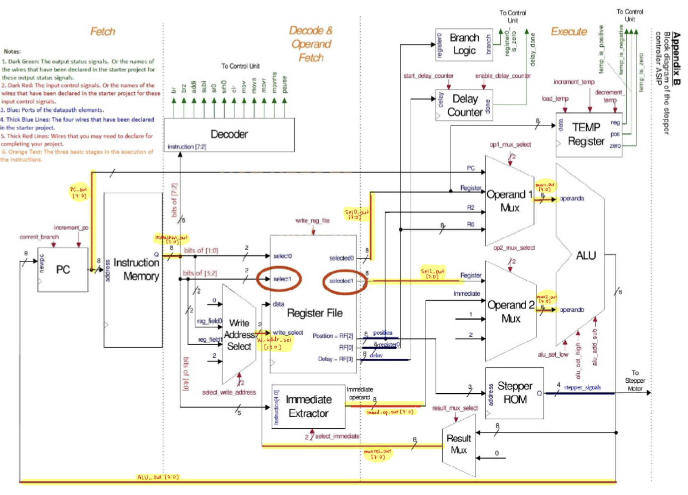
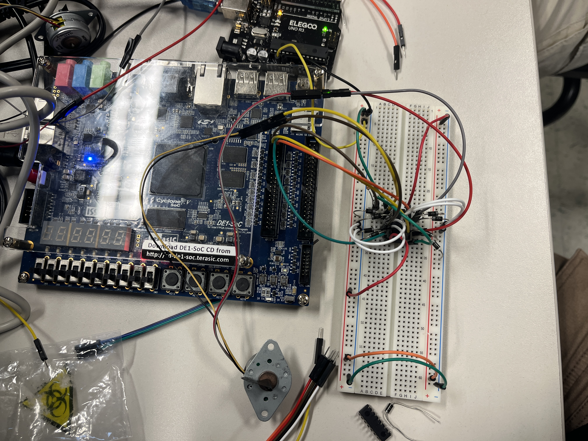

# ASIP Stepper Motor Controller

This project involves the design and implementation of an Application Specific Instruction Set Processor (ASIP) on the DE1-SoC FPGA for controlling a stepper motor. The processor is built entirely in Verilog and includes a custom datapath and control unit capable of executing a simplified 8-bit instruction set.

The ASIP consists of a 4-register file (R0–R3), where R0 and R1 are general-purpose registers, while R2 and R3 are dedicated to motor control. Register R2 tracks the motor’s current position in half-steps, updating based on clockwise and counter-clockwise motion, while R3 stores the delay value that determines the timing between motor steps.

The instruction set includes basic operations such as register-to-motor movement (MOVR, MOVRHS), delay control (PAUSE), arithmetic operations (ADDI, SUBI), and register clearing (CLR). These instructions allow the processor to generate precise stepper motor sequences, including full-step and half-step motion with configurable speed and direction.

On the hardware side, the processor interfaces with a motor driver circuit (SN754410NE) connected through the DE1-SoC GPIO expansion pins. The design is synthesized and implemented on the FPGA, with on-chip memory used to store and execute machine-level programs.

Overall, the project demonstrates the construction of a custom processor tailored for a specific control application, combining datapath design, finite-state machine control, and real-time embedded hardware interfacing to achieve precise stepper motor control.

## Demo
This is the [Demo](https://youtu.be/zwOuZycwnS0).

